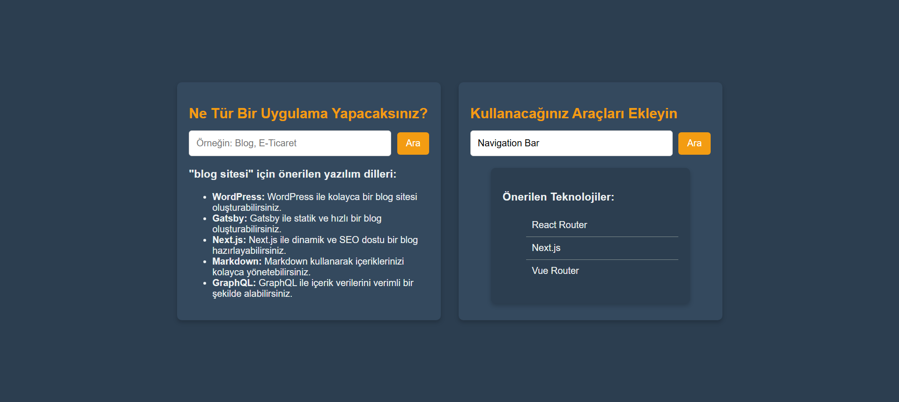

# Tech Finder

This project helps users discover technologies for building different types of applications. Users can search for the tools and technologies they need for their project by selecting the project type and desired technologies.

## Demo

Check out the demo screenshots of the Tech Finder app:




## Technologies Used

- **React**: Used to build the user interface.
- **Vite**: Used for development server and fast builds.
- **TypeScript**: Ensures type safety and better developer experience.
- **CSS**: Used for styling the application.

## Setup Information

This project uses **React** and **Vite** for fast development and builds.

Vite provides a minimal setup for React with **Hot Module Replacement (HMR)** and **ESLint** integration.

## Installation

Follow these steps to get the project up and running:

1. **Clone the Project Repository**:
   ```bash
   git clone https://github.com/batux4n/tech-finder.git
   cd tech-finder
   npm install
   npm run dev

## Contributing
Feel free to fork the repository and submit a pull request if you'd like to contribute to the project.

## License

This project is open-source and available under the [MIT License](LICENSE).
